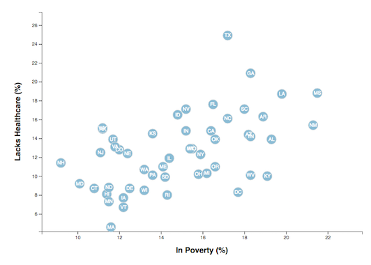

# D3-Challenge

# Background

The purpose of this project is to use the D3 library of JavaScript to create a scatter plot between data variables healthcare and poverty.
The data is based on 2014 American Community Survey 1 year estimates and can be found at https://factfinder.census.gov/faces/nav/jsf/pages/searchresults.xhtml.  

The scatter plot represents each state in the United States using the circle element.  Each circle has the respective state's abbreviation in the circle.  The axis and labels are placed to the left and bottom of the chart.

# Health vs Poverty Plot
 

# How to run:

This project was run using a local server and the html will not run properly otherwise. The command below was used to run the local server.  The host page was viewed using localost:8000 after running the command.
###### `python -m http.server`
